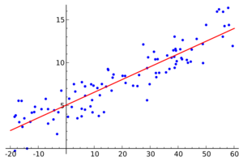
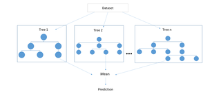
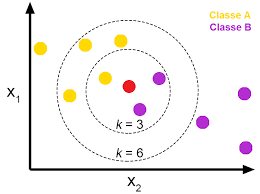

# ICC 2019 WC prediction

I used Machine Learning to make a model using scikit-learn, pandas, numpy, seaborn and matplotlib to predict the results of ICC 2019 
Cricket World Cup. 

Check out the corresponding medium blog post [ICC 2019 cricket world cup prediction using machine learning](https://medium.com/@abhinav.sagar/icc-2019-cricket-world-cup-prediction-using-machine-learning-7c42d848ace1).

## Goals

- Use Machine Learning to predict the winner of ICC 2019 Cricket World Cup.

- Predict the outcome of individual matches for the entire competition.

- Run simulation of the next matches i.e semi finals and finals.

These goals present a unique real-world Machine Learning prediction problem and involve solving various Machine Learning tasks: data wrangling, feature extraction and outcome prediction.

## Data

I used data sets from Kaggle - Results of the matches since 1975 and 2017. I didn't get the data for 2018 and 2019 so this model might not be that accurate but still I believe this gives a fairly good intuition. Also I removed all the data from 1975 to 2010 since what happened way back in the past will have much less weight than the recent results. For the rest of data files I used the crickbuzz website. 

## Environment and tools

1. Jupyter Notebook
2. Numpy
3. Pandas
4. Seaborn
5. Matplotlib
6. Scikit-learn

I used the ICC ranking as of MAY 2019 dataset and a dataset containing the fixture of the group stages of the tournament. I compared Support Vector Machines, Logistic Regression, Random Forest and K-Nearest Neighbours model. Random Forest was the winner with a training accuracy of 70 % and test accuracy of 67.5%.

        Support Vector Machines

        Logistic Regression

        Random Forest

        K-Nearest Neighbours

### According to this model England is likely to win this World Cup.

## Areas of further Improvement

1. Dataset - to improve dataset you could use 2018 and 2019 years into account by scraping them from the ESPN website and also possibly use the players data to assess the quality of each team player.

2. A confusion matrix would be great to analyse which games the model got wrong.

3. We could ensemble that is we could try stacking more models together to improve the accuracy.
